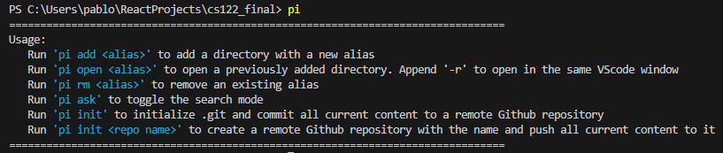

# CLI Tool
### By: Pablo Nava Barrera and Akshit Sharma

# Problem
Navigating and opening projects in VSCode on your computer can take a long time in order to first find it on your computer then open it either from the file browser or in terminal.  
Also, the task of creating a new Github repo and pushing your existing code can be tedious, especially if you are doing this often and is something that could be streamlined. 

# Solution
The goal of this cli tool in Python is to streamline the process of opening new projects in VSCode with pre-saved file paths on your computer. Additionally, by taking advantage of the Github API, the cli tool will also be able to create a repository on your 

# What Application it Covers
This cli tool will deal with File IO as well as some Web Development concepts by using APIs. It will also require OS concepts to manage and pipe outputs from the API's and do error handling on those. This has to work on both Windows and Mac as well.

# High Level Description
The cli will allow users to add a complete path to a folder and save it under an alias. That way, they can run a command with the cli 'open' command and it'll run the VSCode command 'code .' to open that file in a new VSCode window. Another cli command to 'init' a repo will use the Github cli to create a remote repository with a specified name, then add and commit all current code in the current open directory. The user can specify if they want the repo to be public or private. There will be error handling for all command line arguments or responses from required APIs. 

# How to Run
### Setup
Make sure you are running Python 3.12! If you are on Windows, make sure you have WSL enabled.
1. cd into directory
2. Run the corresponding startup script for your OS
3. Open a new terminal and run `pi` to view the initial help message  

### Github integration
1. Get your Github token from github.com
2. Add it to the .env file in line 2 in the format `TOKEN=<token>`

# Working program
### Help message with all functionality  
    

### Listing all saved alias to directory mappings  
  

### Browser search from terminal  
  

### Creating Git repositories, initializing git in local project and pushing all content to new repo
  

